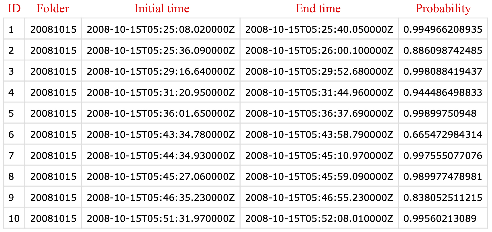
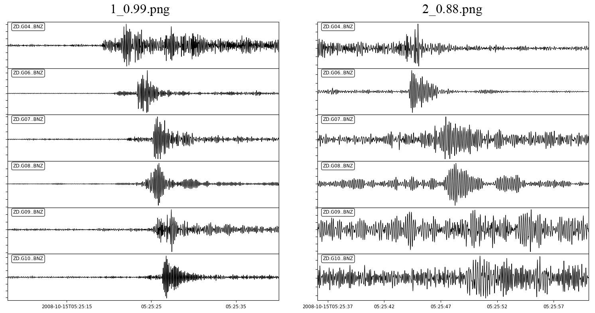

# CNN Earthquake Detection Program

by Shaobo Yang, University of Science and Technology of China, 2020

E-mail: <yang0123@mial.ustc.edu.cn>

References: _Shaobo Yang, Jing Hu, Haijiang Zhang*, Guiquan Liu, Simultaneous Earthquake Detection on multiple stations via Convolutional Neural Network, Seismological Research Letters, in revision._

This repository is used to store scripts and dataset.

## 1. Installation

* Download repository
* Install dependencies: `pip install -i https://pypi.tuna.tsinghua.edu.cn/simple -r requirements.txt`
* Download and unzip test data: `after.zip`

* Download and unzip training data (if training is required): `Events.zip`, `Noise.zip`

  We only provide part of our dataset as an example

* Move these three folders to `CNN_detection/data/`

## 2. Training

A well-trained model path: `CNN_detection/event_detect/saver/cnn/`

If you only want to apply our method to a new dataset, you can pass this step and directly try our well-trained model without training.

If the well-trained model performs bad on your dataset or you want to optimize the CNN architecture, you can modify this code: `CNN_detection/cnn.py`. And you have to modify the configuration file: `CNN_detection/config/config.py`

## 3. Applications

* Put your prepared data set into `CNN_detection/data/after`

* Data preprocessing:
  * Convert data format to SAC
  * Prepare one-day continues 3-component (E, N, Z) waveforms from multiple seismic stations and place them in a folder named by the date
  * The waveforms must have the same initial time and end time

* Check the parameters in the configuration file: `CNN_detection/config/config.py`
* Run the detection program: `python eq_detect.py` 

## 4. Detection results

* An event list: `CNN_detection/event_detect/detect_result/cnn/events_list.csv`

  

* Ploted waveforms: `CNN_detection/event_detect/detect_result/png/`

  The figure name follows the format of `index_probability.png`

